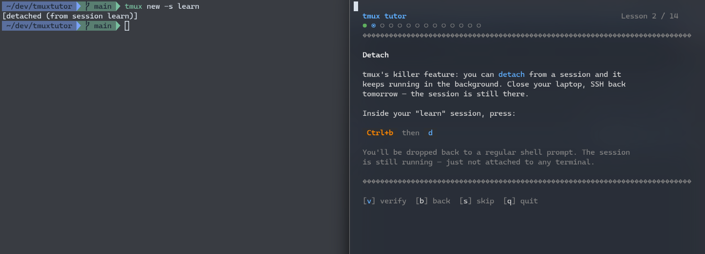
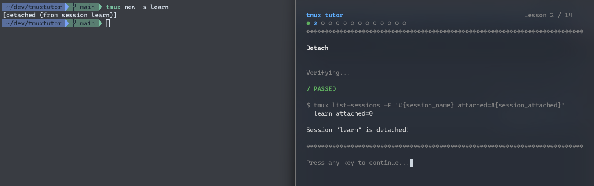
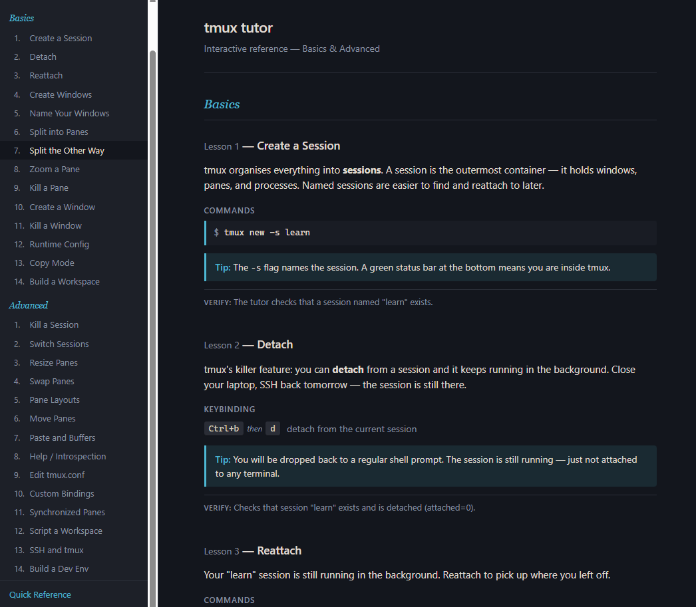
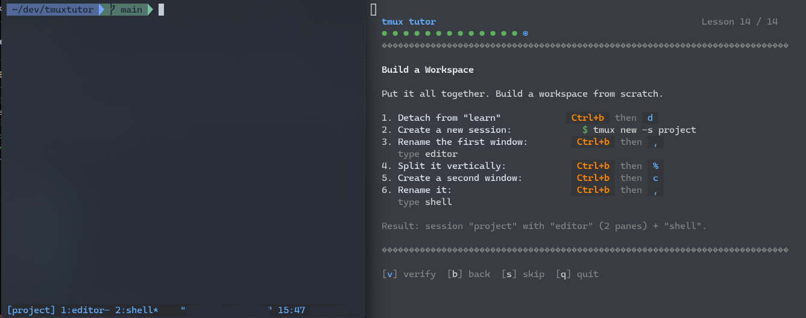
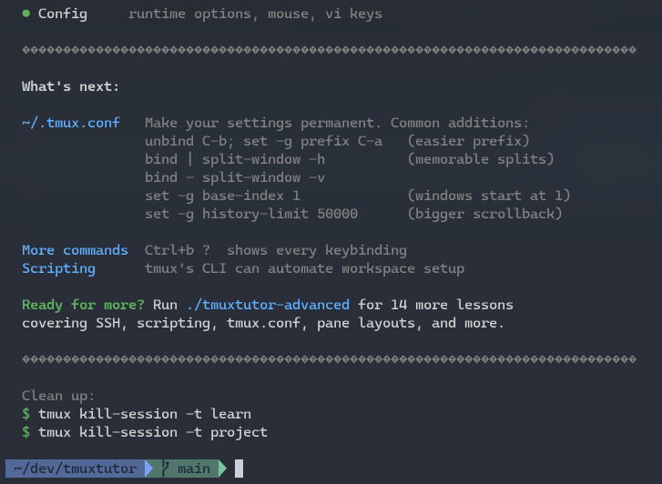
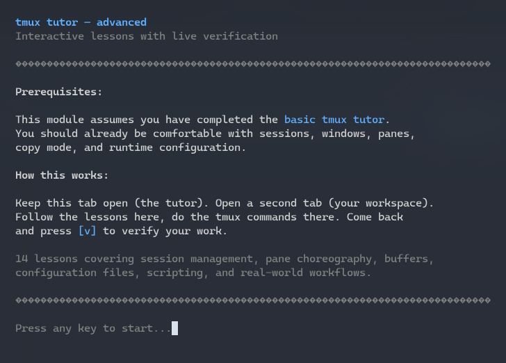
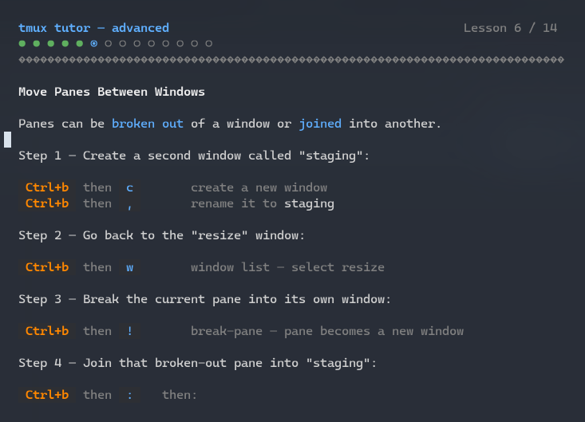
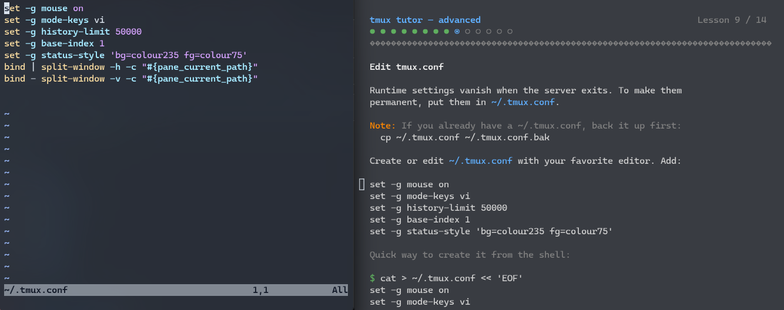
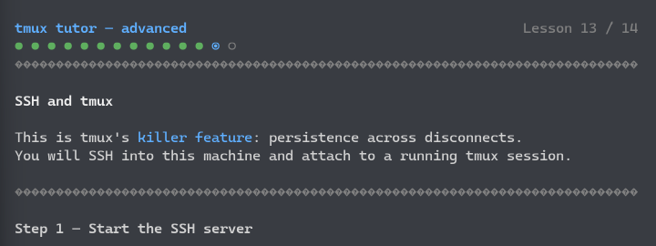
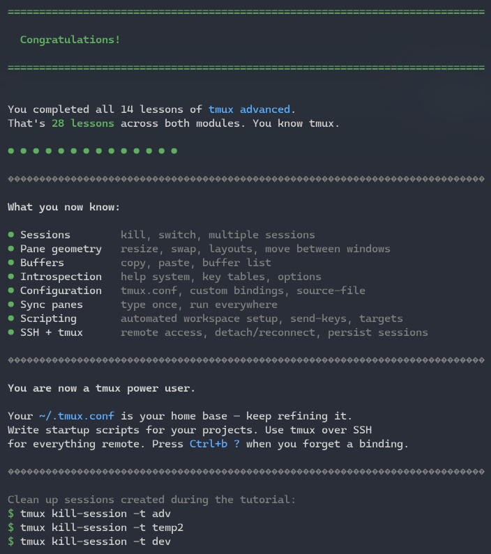

# tmux tutor

**Learn tmux interactively -- like vimtutor, but for tmux.**

28 hands-on lessons that teach you tmux by having you actually use it. No
slides, no videos -- just your terminal, a tutor script, and live verification
that checks your work after every lesson.

<p align="center">
  
</p>

<p align="center">
  
</p>

## Features

- **28 interactive lessons** across two modules (basics + advanced)
- **Live verification** -- the tutor inspects your tmux state and confirms you did it right
- **No install required** beyond bash and tmux -- just clone and run
- **Progress saving** -- quit any time and resume where you left off
- **HTML reference companion** covering all 28 lessons plus a quick reference card

## Quick start

```bash
git clone https://github.com/alejandroerickson/tmuxtutor.git
cd tmuxtutor
./tmuxtutor
```

When you finish the basics, continue with:

```bash
./tmuxtutor-advanced
```

## How it works

Open two terminal windows (or tabs). In the first, run `./tmuxtutor`. The tutor
displays a lesson and tells you what to do. In the second terminal, execute the
tmux commands it asks for. When you think you have it right, press **[v]** in the
tutor to verify -- it checks your live tmux state and tells you whether you
passed.

<p align="center">
  
</p>

## Curriculum

### Basics (`./tmuxtutor`) -- 14 lessons

| # | Lesson |
|---|--------|
| 1 | Create a Session |
| 2 | Detach |
| 3 | Reattach |
| 4 | Create Windows |
| 5 | Name Your Windows |
| 6 | Split into Panes |
| 7 | Split the Other Way |
| 8 | Zoom a Pane |
| 9 | Kill a Pane |
| 10 | Create a Window |
| 11 | Kill a Window |
| 12 | Runtime Configuration |
| 13 | Copy Mode |
| 14 | Build a Workspace |

### Advanced (`./tmuxtutor-advanced`) -- 14 lessons

| # | Lesson |
|---|--------|
| 1 | Kill a Session |
| 2 | Switch Between Sessions |
| 3 | Resize Panes |
| 4 | Swap Panes |
| 5 | Pane Layouts |
| 6 | Move Panes Between Windows |
| 7 | Paste and Buffers |
| 8 | Help and Introspection |
| 9 | Edit tmux.conf |
| 10 | Custom Key Bindings |
| 11 | Synchronized Panes |
| 12 | Script a Workspace |
| 13 | SSH and tmux |
| 14 | Build a Dev Environment |

## HTML reference companion

A self-contained reference covering all 28 lessons and a quick reference card is
available at **[alejandroerickson.com/tmuxtutor](https://alejandroerickson.com/tmuxtutor/)**.

<p align="center">
  
</p>

## Screenshots

<p align="center">
  <br>
  <em>Lesson 14 -- Build a Workspace (capstone)</em>
</p>

<p align="center">
  <br>
  <em>Completing the basics module</em>
</p>

<p align="center">
  <br>
  <em>Advanced module introduction</em>
</p>

<p align="center">
  <br>
  <em>Advanced Lesson 6 -- Move Panes Between Windows</em>
</p>

<p align="center">
  <br>
  <em>Advanced Lesson 9 -- Editing tmux.conf in a split view</em>
</p>

<p align="center">
  <br>
  <em>Advanced Lesson 13 -- SSH and tmux</em>
</p>

<p align="center">
  <br>
  <em>Completing all 28 lessons</em>
</p>

## Requirements

- **bash**
- **tmux**

Install tmux if you don't have it:

```bash
# Ubuntu / Debian
sudo apt install tmux

# macOS (Homebrew)
brew install tmux

# Fedora
sudo dnf install tmux

# Arch
sudo pacman -S tmux
```

## License

[MIT](LICENSE)
